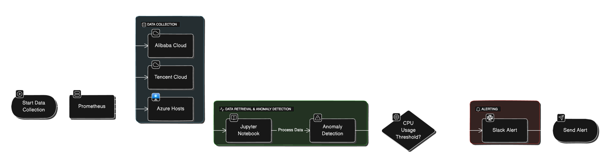

# 基于AI异常检测的云主机监控与告警系统

本项目展示如何在服务器上使用开源工具构建**智能 IT 运维系统**。该系统从云主机（阿里云、腾讯云、Azure）收集指标数据，分析数据以检测异常，并在 CPU 使用率超过阈值时通过 Slack 自动发送告警。

---

## 架构概览

以下是系统流程的架构图，展示了 **Prometheus 监控**指标、**Jupyter Notebook 分析**数据、以及 **Slack 发送告警**的流程。



---

## 文件结构
```bash
├── cpu_monitor.py  # CPU 监控脚本
├── prometheus.yml  # Prometheus的配置文件
├── Grafana_Dashboard_Updated_CPU_Only.json  #Grafana Dashboard 的CPU指标数据仪表盘
```

---
## 组件

- **Linux 服务器**：承载所有服务的核心平台。
- **Prometheus**：从云主机收集指标数据。
- **Jupyter Notebook**：通过 Python 和 Scikit-learn 对收集的数据进行分析和异常检测。
- **Scikit-learn**：用于构建 K-means 模型，进行异常检测和分析。
- **Slack**：发送检测到的异常告警。
- **Zammad**（可选）：可集成以管理工单。

---

## 安装与部署

### 1. 安装 Python 和 Jupyter Notebook
```bash
sudo dnf install python3 python3-pip -y
pip3 install notebook
jupyter notebook --ip=0.0.0.0 --port=8888 --no-browser
```

访问地址为：`http://<你的服务器IP>:8888`

### 2. 安装 Prometheus
下载并设置 Prometheus：
```bash
wget https://github.com/prometheus/prometheus/releases/download/v2.46.0/prometheus-2.46.0.linux-amd64.tar.gz
tar -xvzf prometheus-2.46.0.linux-amd64.tar.gz
cd prometheus-2.46.0.linux-amd64
./prometheus --config.file=prometheus.yml
```

将需要监控过的主机添加至Prometheus配置文件：
```yaml
global:
  scrape_interval: 1m
  scrape_timeout: 10s
  scrape_protocols:
    - OpenMetricsText1.0.0
    - OpenMetricsText0.0.1
    - PrometheusText0.0.4
  evaluation_interval: 1m
runtime:
  gogc: 75
scrape_configs:
- job_name: node exporter
  honor_timestamps: true
  track_timestamps_staleness: false
  scrape_interval: 1m
  scrape_timeout: 10s
  scrape_protocols:
    - OpenMetricsText1.0.0
    - OpenMetricsText0.0.1
    - PrometheusText0.0.4
  metrics_path: /metrics
  scheme: http
  enable_compression: true
  follow_redirects: true
  enable_http2: true
  static_configs:
  - targets:
      - <tencent-cloud-instance>:9100
    labels:
      instance: Tencent
  - targets:
      - <aliyun-cloud-instance>:9100
    labels:
      instance: Aliyun
  - targets:
      - <azure-cloud-instance>:9100
    labels:
      instance: Azure
```

### 3. 在 Jupyter Notebook 中查询指标数据，集成 Scikit-learn 机器学习库， 通过 KMeans 模型检测 CPU 使用率的异常。
```python
import requests
import pandas as pd
from sklearn.cluster import KMeans
import time

PROMETHEUS_URL = 'http://<你的Prometheus服务器>:9090/api/v1/query'

# 获取 CPU 使用率数据，使用 fetch_cpu_usage() 函数获取 Prometheus 的实时 CPU 数据。
def fetch_cpu_usage():
    query = '100 - (avg by(instance)(irate(node_cpu_seconds_total{mode="idle"}[5m])) * 100)'
    response = requests.get(PROMETHEUS_URL, params={'query': query})
    data = response.json()['data']['result']
    metrics = [{'instance': item['metric']['instance'], 'value': float(item['value'][1])} for item in data]
    return metrics

# 使用 K-means 进行异常检测，detect_anomalies() 函数进行异常检测，并返回异常的主机实例。
def detect_anomalies(data):
    df = pd.DataFrame(data)
    model = KMeans(n_clusters=2)  # 设置两类，正常和异常
    df['anomaly'] = model.fit_predict(df[['value']])
    
    # 返回异常实例
    anomalies = df[df['anomaly'] == 1]
    return anomalies

# 主程序
while True:
    cpu_metrics = fetch_cpu_usage()  # 获取 CPU 数据
    anomalies = detect_anomalies(cpu_metrics)  # 进行异常检测

    # 如果有异常则发送告警
    if not anomalies.empty:
        send_alert(anomalies)
        print("告警已发送到 Slack。")
    else:
        print("系统正常。")
    
    time.sleep(300)  # 每 5 分钟运行一次
```

### 4. 在 Jupyter Notebook 中可视化指标数据
```python
import matplotlib.pyplot as plt

df.plot(kind='bar', x='instance', y='value', legend=False)
plt.title('各实例 CPU 使用率')
plt.ylabel('CPU 使用率 (%)')
plt.xlabel('实例')
plt.show()
```

### 5. 异常检测与 Slack 告警
```python
SLACK_WEBHOOK_URL = 'https://hooks.slack.com/services/your/slack/webhook'
threshold = 80.0
anomalies = df[df['value'] > threshold]

if not anomalies.empty:
    message = f"警告！检测到以下实例 CPU 使用率过高：
{anomalies.to_string(index=False)}"
    requests.post(SLACK_WEBHOOK_URL, json={'text': message})
    print("告警已发送到 Slack。")
else:
    print("未检测到异常。")
```
### 6. 配置并部署 Grafana Dashboard

仪表盘监控阿里云、腾讯云和 Azure 主机的 CPU 使用率。通过 Node Exporter 获取这些主机的实时指标数据，并在 Grafana 仪表盘中进行可视化。
仪表盘的配置文件参考：Grafana_Dashboard_Updated_CPU_Only.json

示例仪表盘 包含以下信息：

	•	实例 CPU 使用率趋势图
	•	实时监控各主机 CPU 利用率


---

## 监控脚本

在项目目录下新建文件 **\`cpu_monitor.py\`**，并粘贴以下代码：

```python
import requests
import pandas as pd
from sklearn.cluster import KMeans
import time

PROMETHEUS_URL = 'http://<你的Prometheus服务器>:9090/api/v1/query'
SLACK_WEBHOOK_URL = 'https://hooks.slack.com/services/your/slack/webhook'

# 获取 CPU 使用率数据
def fetch_cpu_usage():
    query = '100 - (avg by(instance)(irate(node_cpu_seconds_total{mode="idle"}[5m])) * 100)'
    response = requests.get(PROMETHEUS_URL, params={'query': query})
    data = response.json()['data']['result']
    metrics = [{'instance': item['metric']['instance'], 'value': float(item['value'][1])} for item in data]
    return metrics

# 使用 K-means 进行异常检测
def detect_anomalies(data):
    df = pd.DataFrame(data)
    model = KMeans(n_clusters=2)  # 设置两类，正常和异常
    df['anomaly'] = model.fit_predict(df[['value']])
    
    # 返回异常实例
    anomalies = df[df['anomaly'] == 1]
    return anomalies

# 发送 Slack 告警
def send_alert(anomalies):
    message = f"⚠️ 警告！以下实例 CPU 使用率异常：\n{anomalies.to_string(index=False)}"
    requests.post(SLACK_WEBHOOK_URL, json={'text': message})

# 主程序
while True:
    cpu_metrics = fetch_cpu_usage()  # 获取 CPU 数据
    anomalies = detect_anomalies(cpu_metrics)  # 进行异常检测

    # 如果有异常则发送告警
    if not anomalies.empty:
        send_alert(anomalies)
        print("告警已发送到 Slack。")
    else:
        print("系统正常。")
    
    time.sleep(300)  # 每 5 分钟运行一次
```

---
## 运行监控程序

### 1. 使用 \`nohup\` 后台运行  
在终端中运行以下命令，确保监控程序在后台运行，并将输出保存到日志文件。

```bash
nohup python3 cpu_monitor.py > monitor.log 2>&1 &
```

- **\`nohup\`**：防止程序因会话断开而中止。  
- **\`&\`**：让程序在后台运行。  
- **\`monitor.log\`**：保存日志输出。

### 2. 检查进程是否运行  
```bash
ps aux | grep cpu_monitor.py
```

### 3. 停止后台进程  
找到进程号（PID）并终止进程：

```bash
kill <PID>
```

---

## 日志查看

查看监控程序的日志输出：

```bash
tail -f monitor.log
```

---
## 未来改进

- 集成 **Zammad** 实现基于告警的自动工单创建。
- 使用 **Grafana** 实现高级可视化与仪表盘。
- 探索 **scikit-learn** 等机器学习库，实现更复杂的异常检测模型。

---

## 许可证
本项目基于 MIT 许可证。
